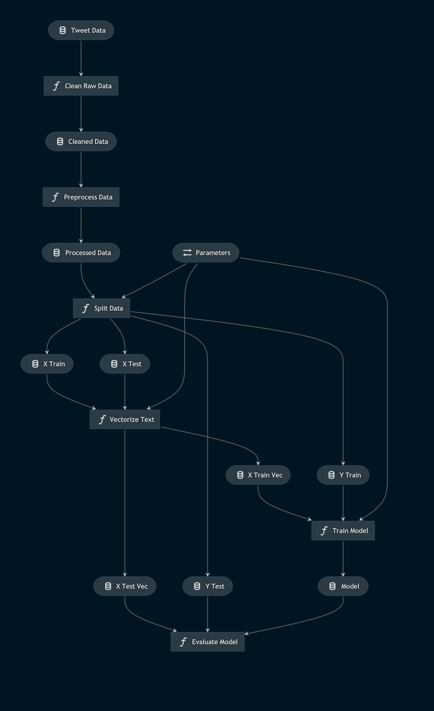

# Example for using Kedro for an NLP pipeline

In this example, [Kedro](https://github.com/quantumblacklabs/kedro) was used to create a workflow to achieve the following:
* Pre-process the [Sentiment140 dataset](https://www.kaggle.com/kazanova/sentiment140) containing 1.6 million tweets
* Train a Logistic Regression model for sentiment prediction based on the text of the tweets
* Evaluate the trained model and generate a classification report

This project was created as part of the [PyCon India 2020 Devsprint](https://in.pycon.org/2020/)

### Workflow Visualization using ```kedro-viz```


### Acknowledgement

Special thanks to [Lais Carvalho](https://github.com/laisbsc) for her guidance through the devsprint.
